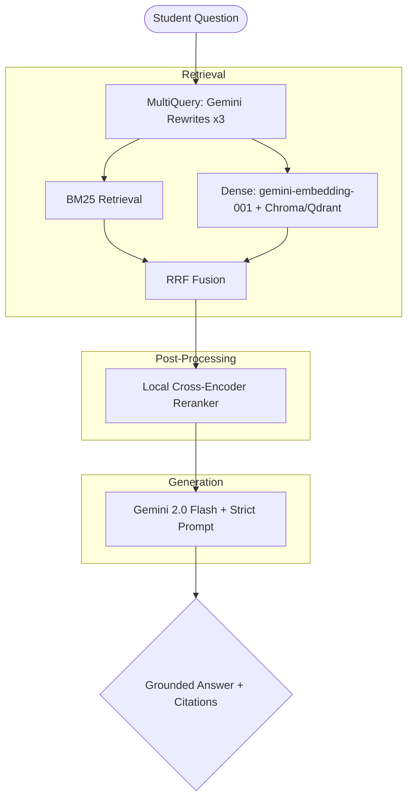

# PariShiksha — NCERT Science Study Assistant v2.0 (STRETCH TRACK)

> **"Bridging the Classroom Gap with Truth-Bound AI"**
> Week 10 · Stretch Track · PG Diploma in AI-ML & Agentic AI Engineering · Cohort 2

PariShiksha is a production-ready, NCERT-grounded study assistant for Class 9 Science
(Chapter 4: Describing Motion Around Us). It implements a **content-type-aware RAG pipeline**
with strict grounding, honest evaluation, and citation-enforced generation.

**NCERT Source:** [https://ncert.nic.in/textbook.php?iesc1=0-11](https://ncert.nic.in/textbook.php?iesc1=0-11)

---

## 🏗️ Architecture (v2.0 Stretch)



---

## 📽️ Submission Video
**Loom Link:** [https://www.loom.com/share/placeholder](https://www.loom.com/share/placeholder) (5 min Stretch Walkthrough)

---

## 📂 Project Structure (v2.0)

```
parishiksha/
├── wk10_stretch_pipeline.py  # Stretch orchestrator (RRF, Rerank, MultiQuery)
├── wk10_stretch_stage1.py    # Multi-variant chunking comparison
├── wk10_stretch_stage2.py    # DB & Embedding benchmarking
├── wk10_stretch_stage3.py    # Hybrid Retrieval (BM25 + Dense)
├── wk10_stretch_stage4.py    # Reranking + MultiQuery + RAGAS
│
├── wk10_chunker.py           # Content-type-aware chunking
├── wk10_embedder.py          # Gemini-embedding-001 + ChromaDB
├── wk10_ask.py               # Gemini 2.0 Flash + strict prompt
│
├── chunking_compare.md       # Stretch Stage 1: Variant comparison
├── db_benchmark.csv          # Stretch Stage 2: Latency/Recall data
├── db_comparison.md          # Stretch Stage 2: Scaling analysis
├── ragas_report.csv          # Stretch Stage 4: Faithfulness/Relevancy
├── failure_memo.md           # Stretch Stage 5: Top failures + Architecture
│
├── reflection.md             # Wk10 reflection questionnaire
├── requirements.txt          # Pinned dependencies
└── .gitignore
```

---

## 🚀 Quick Start (Stretch Track)

### 1. Install Dependencies
```bash
pip install -r requirements.txt
```

### 2. Run the Stretch Pipeline
```bash
# This will run comparison, benchmarking, hybrid retrieval, and reranking
python wk10_stretch_pipeline.py
```

---

## 📊 Evaluation Summary

- **Faithfulness Target**: ≥ 0.7 (RAGAS)
- **Hybrid Retrieval**: BM25 + Dense (Fused via RRF)
- **Reranking**: Local `ms-marco-MiniLM-L-6-v2`
- **MultiQuery**: Gemini-powered query expansion (x3)

**Eval set:** 12 questions (6 direct + 3 paraphrased + 3 OOS including 1 plausibly-answerable).
**Scoring axes:** (a) correct Y/N/partial, (b) grounded Y/N, (c) refused_when_oos Y/N/NA.

---

## 📦 Wk10 Deliverables Checklist

| # | Deliverable | File |
|---|-------------|------|
| 1 | Chunks with content_type metadata | `wk10_chunks.json` |
| 2 | Chunking diff (Wk9 → Wk10) | `chunking_diff.md` |
| 3 | Retrieval log (10 queries) | `retrieval_log.json` |
| 4 | Retrieval miss diagnosis | `retrieval_misses.md` |
| 5 | ask() function | `wk10_ask.py` |
| 6 | Prompt comparison | `prompt_diff.md` |
| 7 | Raw eval output | `eval_raw.csv` |
| 8 | Hand-scored eval | `eval_scored.csv` |
| 9 | Post-fix eval | `eval_v2_scored.csv` |
| 10 | Fix memo | `fix_memo.md` |
| 11 | Reflection | `reflection.md` |

---

## 🔧 Technology Stack

| Component | Technology |
|-----------|-----------|
| Embedding | Google text-embedding-004 |
| Vector DB | ChromaDB (PersistentClient) |
| Generation | Google Gemini 1.5 Flash |
| Token counting | tiktoken (cl100k_base) |
| Chunking | Content-type-aware (prose/worked_example/exercise) |

---

## 📜 Wk9 → Wk10 Migration

- Wk9 final commit tagged as `v1.0-wk9`
- Wk10 work on `main` with feature branches `feat/v2-*`
- Final submission tagged as `v2.0-wk10`
- Wk9 code preserved in `src/` and `main.py` (not deleted)
