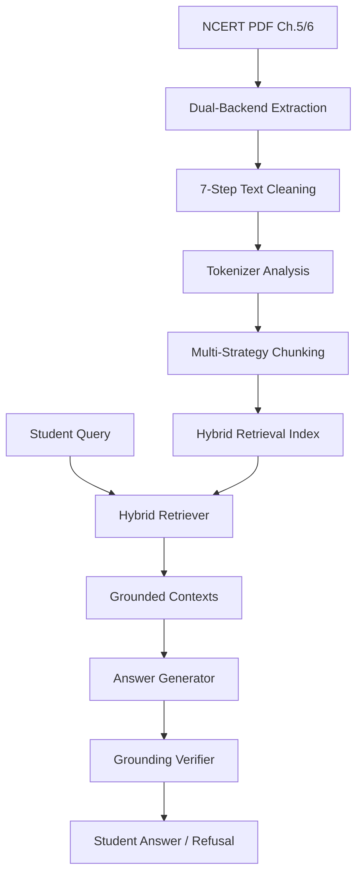

# PariShiksha — Retrieval-Ready Science Study Assistant

> **Week 9 Mini-Project** · PG Diploma in AI-ML & Agentic AI Engineering · Cohort 2

PariShiksha is a bounded, NCERT-grounded study assistant designed for Class 9–10 Science students. Unlike generic LLMs, PariShiksha ensures every answer is strictly retrieved from and grounded in the official NCERT textbook context to prevent hallucinations and ensure pedagogical accuracy.

---

## 🌟 Project Highlights

*   **Dual-Backend Extraction**: PyMuPDF + pdfplumber cross-validation for robust PDF processing.
*   **7-Step Cleaning Pipeline**: Targeted removal of NCERT-specific noise (mojibake, headers/footers, dangling figure references).
*   **Hybrid Retrieval Architecture**: α-weighted combination of dense semantic search (SBERT) and sparse keyword matching (TF-IDF).
*   **Dual-Model Comparison**: Evaluated against both Gemini (decoder-only) and Flan-T5 (encoder-decoder) architectures.
*   **Closed-Loop Grounding**: Multi-level verification (lexical + sentence-level) to catch and block hallucinations in real-time.

---

## 🏗️ System Architecture



---

## 📂 Folder Structure

```text
parishiksha/
├── main.py                         # Unified CLI pipeline orchestrator
├── requirements.txt                # Project dependencies
├── config/
│   └── config.py                   # Central parameters & hyperparameters
├── src/
│   ├── extraction/                 # PDF extraction & text cleaning
│   ├── chunking/                   # Strategy-based text segmentation
│   ├── retrieval/                  # Dense/Sparse embeddings & hybrid search
│   ├── generation/                 # Grounded QA (Gemini/T5) & Verification
│   └── evaluation/                 # Metrics & Eval set builder
├── tests/                          # 35+ unit and integration tests
├── docs/                           # Architecture, Reflection & Reports
├── data/                           # (Created) Storage for PDFs/Extracts/Chunks
└── outputs/                        # (Created) Results/Plots/Evaluation logs
```

---

## 🚀 Quick Start

### 1. Installation

```bash
# Clone the repository
git clone https://github.com/Avichatt/-week09-student-project-parishiksha.git
cd -week09-student-project-parishiksha

# Create virtual environment
python -m venv venv
source venv/bin/activate  # Windows: venv\Scripts\activate

# Install dependencies
pip install -r requirements.txt

# Setup NLP models
python -c "import nltk; nltk.download('punkt_tab')"
```

### 2. Configuration

1.  Copy `.env.example` to `.env`
2.  Add your `GEMINI_API_KEY` (Get one at [Google AI Studio](https://aistudio.google.com/app/apikey))
3.  Download NCERT Class 9 Science PDFs from the official source:
    - **Source**: [https://ncert.nic.in/textbook.php?iesc1=0-11](https://ncert.nic.in/textbook.php?iesc1=0-11)
    - Chapter 5 — The Fundamental Unit of Life (`iesc105.pdf`)
    - Chapter 6 — Tissues (`iesc106.pdf`)
    - Place both PDFs in `data/raw/`

### 3. Execution

The project follows a 4-stage pipeline orchestrated by `main.py`:

```bash
# Run the end-to-end pipeline (Approx. 2-3 mins)
python main.py --stage all

# Or run individual stages:
python main.py --stage extract    # Stage 1: Extraction & Cleaning
python main.py --stage chunk      # Stage 2: Strategy Experimentation
python main.py --stage retrieve   # Stage 3: Retrieval & Answer Gen
python main.py --stage evaluate    # Stage 4: System Evaluation
```

### 4. Testing

```bash
python -m pytest tests/ -v
```

---

## 📊 Expected Inputs & Outputs

### Inputs
*   **PDFs**: NCERT Class 9 Science chapters (`iesc105.pdf`, `iesc106.pdf`).
*   **Queries**: Student questions in English or Hindi-English mixed (e.g., *"What is specialized function of mitochondria?"*).

### Outputs
*   **Structured Data**: Cleaned JSON extracts and segment-aware chunks.
*   **Retrieval Analytics**: Comparison plots of tokenizer fragmentation and chunking statistics.
*   **Evaluation Reports**: Comprehensive scoring across 5 question types (Factual, Conceptual, Application, Unanswerable, Code-switched).

---

## 👩‍💻 Engineering Highlights

*   **Clean Code**: No magic strings; all paths and models managed via `config.py`.
*   **Robustness**: Handles Windows/Linux pathing and failed building of C++ extensions gracefully.
*   **Academic Integrity**: Includes a full `reflection.md` documenting design decisions and architecture trade-offs.

---

## 📄 License
Educational project for PG Diploma in AI-ML & Agentic AI Engineering.
Content from NCERT is © NCERT India.
