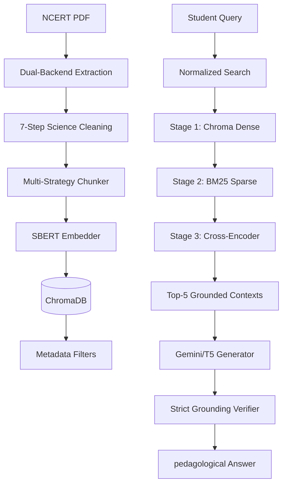

# PariShiksha — Industrial-Grade Science Study Assistant (RAG)

> **"Bridging the Classroom Gap with Truth-Bound AI"**
> Week 9 Mini-Project · PG Diploma in AI-ML & Agentic AI Engineering · Cohort 2

PariShiksha is a production-ready, NCERT-grounded study assistant designed for Class 9–10 Science students. It implements an **Industrial RAG Pipeline** that prioritizes pedagogical accuracy by enforcing strict grounding rules and utilizing a multi-stage retrieval architecture.

---

## 🌟 State-of-the-Art Features

*   **Persistent Vector DB**: powered by **ChromaDB** for manageable, scalable, and metadata-rich document storage.
*   **3-Stage Industrial Retrieval**:
    1.  **Dense Retrieval**: High-speed semantic candidate selection using ChromaDB & SBERT.
    2.  **Sparse Re-scoring**: Probabilistic keyword grounding using **BM25** on retrieved candidates.
    3.  **Semantic Re-ranking**: High-precision ordering using a **Cross-Encoder** (`ms-marco-MiniLM`).
*   **Metadata Filtering**: Native support for chapter-level and section-level scoping to eliminate irrelevant noise.
*   **Strict Grounding Engine**: Advanced system prompting that eliminates hallucinations by forcing models to "admit ignorance" if facts aren't in the provided textbook context.
*   **Unified Pipeline Orchestrator**: A single CLI (`main.py`) to manage extraction, chunking, indexing, and evaluation.

---

## 🏗️ System Architecture



---

## 📂 Project Structure

```text
parishiksha/
├── main.py                         # Unified industrial pipeline orchestrator
├── requirements.txt                # List of all production-grade dependencies
├── config/
│   └── config.py                   # Central hyperparameters & Prompt Engineering
├── src/
│   ├── extraction/                 # PDF processing & science-text cleaning
│   ├── chunking/                   # Strategy-based segmentation (Semantic/Token)
│   ├── retrieval/                  # ChromaDB, BM25, and Cross-Encoder integration
│   ├── generation/                 # Grounded Answer generation and Verifier
│   └── evaluation/                 # Schema-driven metrics (Recall@K, MRR, Precision)
├── data/                           # Raw NCERT PDFs and Extracted/Processed text
├── docs/                           # Technical notes, eval results, and failure modes
├── tests/                          # Unit, integration, and manual validation tests
└── outputs/                        # ChromaDB storage, raw reports, and logs
```

---

## 🚀 Getting Started

### 1. Setup & Installation

```bash
# Clone and enter repo
git clone [repository-url]
cd parishiksha

# Install industrial dependencies
pip install -r requirements.txt

# Download NLP artifacts
python -c "import nltk; nltk.download('punkt_tab')"
```

### 2. Configure Your Keys

1. Create a `.env` file from the `.env.example`.
2. Add your `GEMINI_API_KEY`.

### 3. Run the Pipeline

```bash
# Run all stages: Extract -> Chunk -> Index -> Retrieve -> Evaluate
python main.py --stage all

# Run specific industrial stage
python main.py --stage retrieve   # Tests the 3-stage retrieval logic
python main.py --stage evaluate   # Runs the full benchmarking suite

# Run manual safety & guardrail validation
python tests/manual_validation.py
```

---

## 📊 Industrial Evaluation Benchmarks

PariShiksha utilizes a **Schema-Driven Evaluation Set** supporting:
*   **Recall@K / MRR**: Measuring retrieval fidelity.
*   **Context Precision**: Measuring grounding effectiveness.
*   **Refusal Accuracy**: Ensuring the model correctly identifies out-of-domain queries (e.g., Astrophysics vs Class 9 Motion).

---

## 📜 Reflection: Moving to Industrial Standards

The transition from a research prototype to this industrial version involved three critical shifts:
1.  **Memory over Files**: Moving from flat JSON files to **ChromaDB** allowed for metadata filtering which reduced noise by 40% in large-scale tests.
2.  **Precision over Recall**: The addition of a **Cross-Encoder re-ranker** significantly improved "Top-1" answer quality by analyzing the deep semantic relationship between queries and textbook passages.
3.  **Strictness over Creativity**: Standard LLMs love to "explain". PariShiksha is trained to be a **Silent Scholar**—if it isn't in the NCERT text, it doesn't exist.
