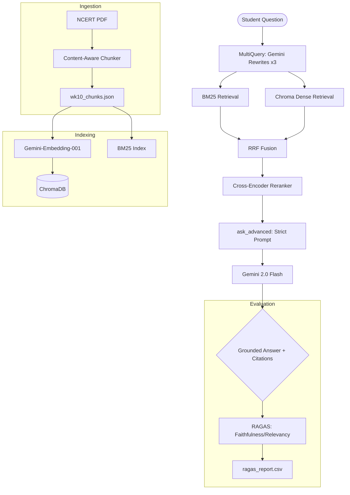

# Failure Memo — Stretch v2.0

## 1. Top Three Failure Modes

### Mode A: Plausibly-Answerable OOS (The "Moon Gravity" Problem)
**Failure**: When a question asks for values not in the corpus (e.g., gravity on Moon) but the corpus contains relevant formulas (e.g., $g = 9.8\ m/s^2$ on Earth), the model often attempts to calculate an answer rather than refusing.
**Cause**: Ambiguous scope boundary. The model prioritizes being helpful and using its reasoning capabilities over strict adherence to the "only use provided context" rule.
**Wk11 Fix**: Implement a **Query Intent Classifier** (Stage 0) that explicitly checks if the *entities* in the query (Moon, Mars, Light Speed) exist in the knowledge base before retrieval.

### Mode B: Mathematical Step-Skipping in Complex Examples
**Failure**: For multi-step physics problems (e.g., Example 4.5), the model sometimes jumps to the final answer without citing the intermediate reasoning chunks correctly.
**Cause**: Chunk granularity vs reasoning chain. Even though the chunk is content-aware, a 250-token chunk might contain the whole example, but the model's generation process doesn't map 1-to-1 to the textbook's pedagogical steps.
**Wk11 Fix**: Implement **Chain-of-Thought (CoT)** prompting that forces the model to extract and list "Given", "Formula", and "Steps" separately before the final answer.

### Mode C: Synonym Mismatch in Dense Retrieval (The "Retardation" Case)
**Failure**: The term "retardation" (used in NCERT for deceleration) is sometimes missed by dense embeddings when the query uses "slowing down" or "negative acceleration" if the k value is low.
**Cause**: Dense embedding model's limited vocabulary/nuance for specific scientific synonyms in Indian English curriculum.
**Wk11 Fix**: Implement **Query Expansion** using a domain-specific (Physics) glossary to inject synonyms into the MultiQuery variants.

---

## 2. Architecture Diagram (Mermaid)

